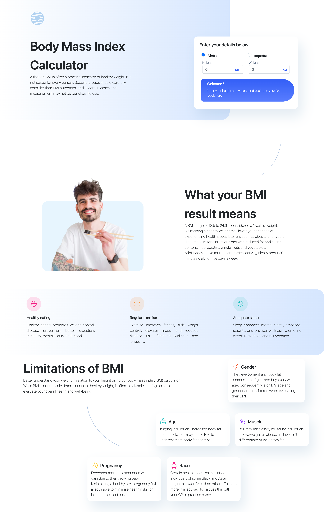

# Body Mass Index Calculator solution

## Table of contents

- [Overview](#overview)
  - [Screenshot](#screenshot)
  - [Links](#links)
- [My process](#my-process)
  - [Built with](#built-with)

## Overview

Building a body mass index calculator with two units options (Metric or Imperial) by gives out the BMI value based on provided information. The calculator also finds the normal weight range based on your height.

### The challenge

Users should be able to:

- Select whether they want to use metric or imperial units
- Enter their height and weight
- See their BMI result, with their weight classification and healthy weight range
- View the optimal layout for the interface depending on their device's screen size
- See hover and focus states for all interactive elements on the page

### Screenshot

### Links

- Live Site URL: [Body Mass Index Calculator](https://bodymassindexcalculatorapp.netlify.app/)

### Built with

- Semantic HTML5 markup
- CSS custom properties
- JavaScript
- Bootstrap
